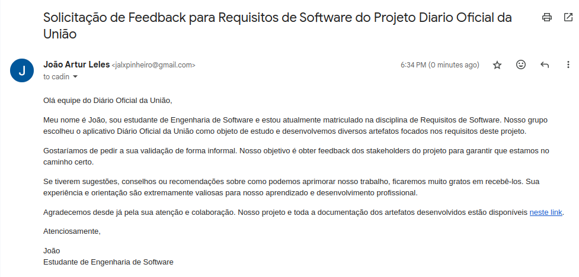
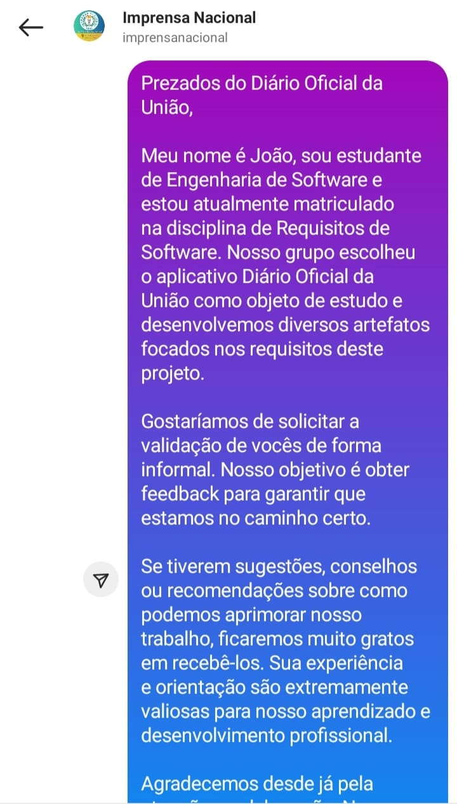
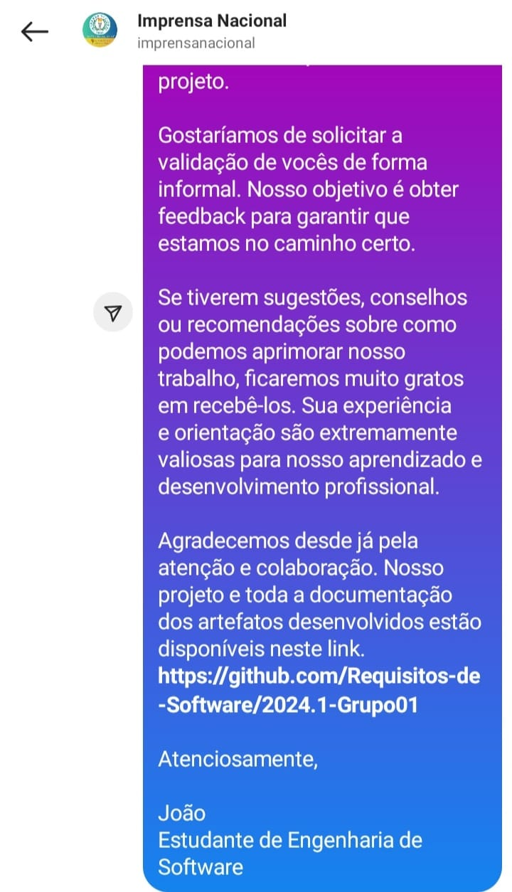

## <a>Introdução</a>

Este artefato tem como objetivo a validação do nosso produto de software, verificando se ele atende às expectativas dos usuários e se o sistema está consistente. Neste documento, abordaremos a metodologia de validação especificamente voltada para a <b>*comprovação informal*</b>, que é uma das estratégias aplicadas para a validação da elicitação de requisitos<a id="anchor_1" href="#REF1">^1^</a>. 

## <a>Objetivo</a>

Uma comprovação informal tem como principal objetivo a execução de uma tarefa de leitura de descrições em linguagem natural e do uso dos clientes para identificar problemas na expressão dos requisitos. Com base nessa estratégios esperamos conseguir a validação dos requisitos ou, se não, identificar a partir disso inconsistências, ambiguidades, falhas, entre outros nos requisitos elicitados referente ao sistema<a id="anchor_2" href="#REF2">^2^</a>.

## <a>Metodologia</a>

A comprovação informal envolve a leitura de descrições em linguagem natural para identificar problemas relacionados aos requisitos. Uma das desvantagens dessa abordagem é a excessiva dependência das habilidades analíticas dos leitores<a id="anchor_2" href="#REF2">^2^</a>.

Para mitigar essa desvantagem, optamos por utilizar ferramentas de comunicação, como o e-mail, para contatar a equipe ou o suporte do Diário Oficial da União e obter feedback. Elaboramos um e-mail formal e estruturado com o objetivo de apresentar o projeto e solicitar feedback específico sobre as funcionalidades e a usabilidade do sistema. Este e-mail detalhado inclui uma introdução ao projeto, os objetivos da validação e as questões específicas para as quais buscamos respostas.

Além do e-mail, também utilizamos o Instagram como uma forma de contato. Através de uma mensagem direta, buscamos interagir com o Suporte do Diário Oficial da União e obter feedback sobre o projeto.

O e-mail, assim como a mensagem no Instagram foram enviados ao cliente no dia 08/06/2024, e temos identificado que essa abordagem nos forneceu insights valiosos para a aprimoração do sistema, garantindo que ele atenda às necessidades e expectativas dos usuários de maneira eficaz.

**A imagem 1 apresenta o email enviado ao Suporte do Diário Oficial da União:**

Imagem 1 - Mensagem por e-mail.

<figure markdown>{: style="height:250px;width:600px"}

Fonte: [João Artur](https://github.com/joao-artl)

**As imagens 2 e 3 apresentam a mensagem enviada ao Suporte do Diário Oficial da União através do Instagram:**

Imagem 2 - Mensagem pelo Instagram 1.

<figure markdown>{: style="width:250px"}

Fonte: [João Artur](https://github.com/joao-artl)

Imagem 3 - Mensagem pelo Instagram 2.

<figure markdown>{: style="width:250px"}

Fonte: [João Artur](https://github.com/joao-artl)

## <a>Retorno do Diário Oficial da União</a>

Até o momento da confecção do artefato (08/06/2024), não foram obtidas respostas de validação. Caso a equipe entre em contato por meio de alguma rede social, será inserida neste artefato a comprovação informal quanto ao que foi desenvolvido no projeto.

## <a>Bibliografia</a>
> <a>1.</a> SERRANO, Milene. SERRANO, Maurício. Requisitos - Aula 23.

## <a>Referências Bibliograficas</a>

> <a id="FRM1" href="#anchor_1">1.</a> SERRANO, Milene. SERRANO, Maurício. Requisitos - Aula 23. Página 28.
> <a id="FRM2" href="#anchor_2">2.</a> SERRANO, Milene. SERRANO, Maurício. Requisitos - Aula 23. Página 31.

## <a>Histórico de versão</a>
|Versão|Data|Data Prevista de Revisão|Descrição|Autor|Revisor|
| :------: | :----------: |:-----------: | :----------------------: | :---------: |:---------: |
| `1.0` | 04/06/2024 | 06/06/2024 | Introdução, metodologias e tabelas. | [Eric Silveira](https://github.com/ericbky) | [Arthur Alves](https://github.com/Arthrok) e [João Artur](https://github.com/joao-artl)|
| `1.1` | 08/06/2024 | 10/06/2024 | Adicionando comprovação por email e Instagram | [João Artur](https://github.com/joao-artl) | [Arthur Alves](https://github.com/Arthrok) e [Eric Silveira](https://github.com/ericbky)|
