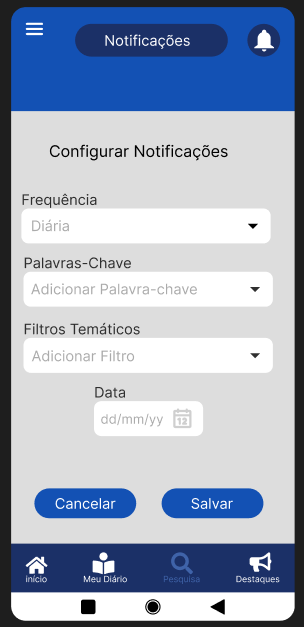

## <a>Introdução</a>

Este artefato tem como objetivo a validação do nosso produto de software, verificando se ele atende às expectativas dos usuários e se o sistema está consistente. Neste documento, abordaremos a metodologia de <b>*validação do protótipo*</b>, que é uma das estratégias aplicadas para a validação da elicitação de requisitos<a id="anchor_1" href="#REF1">^1^</a>. 

## <a>Objetivo</a>

Nosso objetivo é selecionar requisitos elicitados anteriormente e simular sua implementação no sistema para validar se atendem às necessidades dos usuários. Os protótipos podem utilizar linguagens de alto nível ou de especificação de executáveis, visando fornecer feedback contínuo ao universo de informações. Esse processo possibilita a validação dos requisitos e especificações com base nas expectativas dos usuários, assegurando que o sistema desenvolvido corresponda às suas necessidades e demandas<a id="anchor_2" href="#REF2">^2^</a>.

## <a>Metodologia</a>

A tabela 1 representada a seguir demonstra os requisitos selecionados, assim como sua identificação e o responsável pela sua prototipação.

<b>Tabela 1</b> - Informações dos requisitos selecionados.

| **ID**     | **Nome da US**     | **Responsável**     |
|---------|---------------------------------------------------------|---------------------------------------------------------------------------------------------------------------------------------------------------------------------------------------------------------------------------------------------------------------------------------------------|
| US01   | Ajuste automático da data de término     | [Eric Silveira](https://github.com/ericbky)     |
| US05   | Busca por palavras-chave     | [Eric Silveira](https://github.com/ericbky)     |
| US07   | Filtros temáticos geográficos     | [Arthur Alves](https://github.com/arthrok) e [Eric Silveira](https://github.com/ericbky)     |
| US10   | Funcionalidade de histórico de pesquisa   | [João Artur](https://github.com/joao-artl)     |
| US02   | Limitação de diários por página   | [Douglas Marinho](https://github.com/M4RINH0)   |
| US19   | Design responsivo pra dispositivos móveis     | [Luiz Gustavo]()     |
| US06   | Suporte multilíngue   | [Diego Sousa](https://github.com/DiegoSousaLeite), [Douglas Marinho](https://github.com/M4RINH0) e [João Artur](https://github.com/joao-artl)   |
| US08   | Onboarding personalizado     | [Arthur Alves](https://github.com/arthrok)     |
| US09   | Notificações personalizadas   | [Henrique Torres](https://github.com/henriqtorresl)     |
| US18   | Download de documentos pra acesso offline     | [Diego Sousa](https://github.com/DiegoSousaLeite)     |

<b>Fonte:</b> [Arthur Alves](https://github.com/Arthrok), [Eric Silveira](https://github.com/ericbky) e [João Artur](https://github.com/joao-artl).

Após a criação do protótipo, serão conduzidas entrevistas detalhadas com usuários reais para obter feedbacks profundos e insights valiosos. Essas entrevistas são cruciais para coletar informações sobre a usabilidade das novas funcionalidades implementadas, avaliar o entendimento dos usuários sobre essas funcionalidades e medir a eficácia do design proposto. Ao envolver os usuários diretamente, podemos identificar pontos fortes e áreas de melhoria, garantindo que o sistema desenvolvido atenda de forma precisa às necessidades e expectativas dos usuários. Esse processo iterativo de validação é fundamental para assegurar que os requisitos do sistema sejam rigorosamente cumpridos e que o produto final ofereça uma experiência de usuário otimizada e satisfatória.

A seguir na tabela 2, temos a nossa execução de entrevistas para a validação desses protótipos:

<b>Tabela 2</b> - Informações sobre as entrevistas executadas.

Aqui está a nova tabela com as informações adicionais:

| **Nome da US**     | **Avaliador**   | **Entrevistado** | **Horário de Início** | **Duração** | **Local**     |
|-----------------------------------------|---------------------------------------------------------------------------------------------------------------------------------------------------|------------------|-----------------------|-------------|-------------------|
| Ajuste automático da data de término   | [Eric Silveira](https://github.com/ericbky)   | William Bernardo |  22:45  |   23:00   | Microsoft Teams    |
| Busca por palavras-chave   | [Eric Silveira](https://github.com/ericbky)   | William Bernardo |  22:45  |   23:00   | Microsoft Teams    |
| Filtros temáticos geográficos   | [Arthur Alves](https://github.com/arthrok) e [Eric Silveira](https://github.com/ericbky)   |  Júlio Cezar   |  01/07/2024 18:40   |    10 minutos   | Microsoft Teams     |
| Funcionalidade de histórico de pesquisa | [João Artur](https://github.com/joao-artl)   |  José Roberto  |     01/07/2024 20:40      |    5 minutos     | Microsoft Teams     |
| Limitação de diários por página     | [Douglas Marinho](https://github.com/M4RINH0)     |  Ana Júlia     |    01/07/2024 22:00     |   5 minutos    | Microsoft Teams    |
| Design responsivo pra dispositivos móveis | [Luiz Gustavo]()   |  |      |    | Microsoft Teams      |
| Suporte multilíngue     | [Diego Sousa](https://github.com/DiegoSousaLeite), [Douglas Marinho](https://github.com/M4RINH0) e [João Artur](https://github.com/joao-artl)    |   |   |     | Microsoft Teams   |
| Onboarding personalizado   | [Arthur Alves](https://github.com/arthrok)   |  Júlio Cezar   |  01/07/2024 18:30   |    10 minutos   | Microsoft Teams     |
| Notificações personalizadas     | [Henrique Torres](https://github.com/henriqtorresl)   |    Thiago Torres   |   20:00     |   10 minutos   | Microsoft Teams   |
| Download de documentos pra acesso offline | [Diego Sousa](https://github.com/DiegoSousaLeite)   |    |    |      | Microsoft Teams    |

<b>Fonte:</b> [Arthur Alves](https://github.com/Arthrok), [Eric Silveira](https://github.com/ericbky) e [João Artur](https://github.com/joao-artl).

## <a>Protótipos</a>

??? - "US01 - Ajuste automático da data de término"
    ### <a>US01 - Ajuste automático da data de término</a>

    As imagens 1 e 2 apresentam o protótipo correspondente à US01, que trata do ajuste automático da data de término. Este requisito foi implementado para melhorar a experiência dos usuários do Diário Oficial da União (DOU) ao selecionar períodos de tempo para suas pesquisas. Muitas vezes, ao definir um intervalo de datas, a data de término pode não ser ajustada corretamente, causando inconsistências nos resultados. Para resolver esse problema, foi incluído no protótipo um sistema de ajuste automático da data de término, garantindo que ela sempre esteja corretamente alinhada com a data de início selecionada. Essa funcionalidade permite uma configuração mais precisa e eficiente dos períodos de busca, aprimorando significativamente a usabilidade e a confiabilidade do sistema.

    

    ??? "Ver imagem 1"
        Imagem 1 - Página de Pesquisa.

        <figure markdown>{: style="width:300px"}

        Fonte: [Eric Silveira](https://github.com/ericbky)
    
    

    

    ??? "Ver imagem 2"
        Imagem 2 - Resultados de pesquisa.

        <figure markdown>{: style="width:300px"}

        Fonte: [Eric Silveira](https://github.com/ericbky)
    
    

    
    #### <a>Validação com o Entrevistado</a>

    

    <iframe width="560" height="315" src="https://www.youtube.com/embed/DsWJfG-rjpA?si=J9XnAsxOjtk2SQsv" title="YouTube video player" frameborder="0" allow="accelerometer; autoplay; clipboard-write; encrypted-media; gyroscope; picture-in-picture; web-share" referrerpolicy="strict-origin-when-cross-origin" allowfullscreen></iframe>
    

    #### <a>Feedbacks do Entrevistado</a>
    O usuário expressou satisfação com o protótipo desenvolvido, destacando a interface intuitiva e a navegação fácil, que facilitam o uso mesmo para quem não tem muita familiaridade com tecnologia. A disposição clara dos elementos na tela e a identificação fácil dos ícones foram pontos positivos mencionados.

    A performance do protótipo foi elogiada durante os testes, com as principais funcionalidades operando conforme esperado e um fluxo de trabalho fluido. A responsividade do design, adaptando-se bem a diferentes tamanhos de tela, também foi apreciada.

    A atenção aos detalhes e a preocupação em criar uma experiência de usuário agradável foram reconhecidas.

??? - "US02 - Limitação de diários por página"
    ### <a>US02 - Limitação de diários por página</a>

    As imagens 3 apresenta o protótipo referente à US02 de limitação de diários por página. Esse requisito visa melhorar a experiência dos usuários do Diário Oficial da União (DOU) através da visualização do meu diario e dos resultados de pesquisas. Com o DOU sendo uma fonte vasta de informações, a visualização dos diarios se torna muito extensa dependendo da pesquisa o que ocasionava numa rolagem quase infinita algumas vezes para contornar foi incluido na prototipação o sistema de páginas.

    

    ??? "Ver imagem 3"
        Imagem 3 - Resultados de pesquisa.

        <figure markdown>{: style="width:300px"}

        Fonte: [Douglas Marinho](https://github.com/M4RINH0)
    
    

    
    #### <a>Validação com o Entrevistado</a>

    

    <iframe width="560" height="315" src="https://www.youtube.com/embed/2CbnE2voObQ?si=YY1pNfvvCO0TlJza" title="YouTube video player" frameborder="0" allow="accelerometer; autoplay; clipboard-write; encrypted-media; gyroscope; picture-in-picture; web-share" referrerpolicy="strict-origin-when-cross-origin" allowfullscreen></iframe>
    

    #### <a>Feedbacks do Entrevistado</a>
    O usuário achou o protótipo totalmente alinhado com a proposta do requisito e necessário para o melhor uso, apenas citou que poderia trocar as setas ">>" pois usuários com pouca informação podem não entender a função das mesmas.

??? - "US05 - Busca por palavras-chave	"
    ### <a>US05 - Busca por palavras-chave	</a>

    A imagem 4 apresenta o protótipo correspondente à US05, que trata dos resultados da pesquisa por palavras-chave. Este requisito foi implementado para aprimorar a experiência dos usuários do Diário Oficial da União (DOU) ao visualizar os resultados das pesquisas. Dado que o DOU contém uma vasta quantidade de informações, a visualização de resultados pode se tornar muito extensa dependendo da pesquisa, resultando em uma rolagem quase infinita em alguns casos. Para resolver esse problema, foi incluído no protótipo um sistema de busca por palavras chaves. Essa funcionalidade permite uma navegação mais eficiente e organizada, melhorando significativamente a usabilidade do sistema.

    

    ??? "Ver imagem 4"
        Imagem 4 - Resultados de pesquisa.

        <figure markdown>{: style="width:300px"}

        Fonte: [Eric Silveira](https://github.com/ericbky)
    
    

    
    #### <a>Validação com o Entrevistado</a>

    

    <iframe width="560" height="315" src="https://www.youtube.com/embed/DsWJfG-rjpA?si=J9XnAsxOjtk2SQsv" title="YouTube video player" frameborder="0" allow="accelerometer; autoplay; clipboard-write; encrypted-media; gyroscope; picture-in-picture; web-share" referrerpolicy="strict-origin-when-cross-origin" allowfullscreen></iframe>
    

    #### <a>Feedbacks do Entrevistado</a>
    O usuário expressou grande satisfação com o protótipo, ressaltando a interface amigável e a facilidade de navegação, que tornam o sistema acessível até para os menos experientes em tecnologia. A organização clara dos elementos na tela e a facilidade de identificação dos ícones foram aspectos especialmente apreciados.

    Durante os testes, a performance do protótipo foi elogiada, com todas as funcionalidades principais funcionando corretamente e proporcionando um fluxo de trabalho eficiente. A responsividade do design, que se ajusta bem a diferentes dispositivos, também foi destacada como um ponto positivo.

    A performance do protótipo foi elogiada durante os testes, com as principais funcionalidades operando conforme esperado e um fluxo de trabalho fluido. A responsividade do design, adaptando-se bem a diferentes tamanhos de tela, também foi apreciada.

    A atenção aos detalhes e a preocupação em criar uma experiência de usuário agradável foram reconhecidas.

??? - "US07 - Filtros temáticos geográficos"
    ### <a>US07 - Filtros temáticos geográficos</a>

    As imagens 5 e 6 representa o protótipo referente ao requisito de filtros temáticos geográficos. O requisito tem como objetivo implementar um filtro para pesquisa avançada capaz de filtrar os diários de acordo com seu impacto (Nacional, Regional e Estadual).

    

    ??? "Ver imagem 5"
        Imagem 5 - Filtro temático geográfico

        <figure markdown>{: style="width:300px"}

        Fonte: [Arthur Alves](https://github.com/arthrok) e [Eric Silveira](https://github.com/ericbky)

    ??? "Ver imagem 6"
        Imagem 6 - Filtro temático geográfico com dropdown aberto.

        <figure markdown>{: style="width:300px"}

        Fonte: [Arthur Alves](https://github.com/arthrok) e [Eric Silveira](https://github.com/ericbky)
    
    

    #### <a>Validação com o Entrevistado</a>
    

    <iframe width="640" height="360" src="https://www.youtube.com/embed/XwQ9IXOkhU8" title="Validação US07 - Filtro temático de impacto geográfico" frameborder="0" allow="accelerometer; autoplay; clipboard-write; encrypted-media; gyroscope; picture-in-picture; web-share" referrerpolicy="strict-origin-when-cross-origin" allowfullscreen></iframe>
    

    #### Feedbacks do Entrevistado
    O entrevistado teve dificuldade em entender o termo "Impacto Geográfico". Como o intuito é que o aplicativo seja acessível para pessoas com diferentes níveis de instrução, o termo deverá ser trocado de forma que fique mais fácil de ser entendido.

??? - "US08 - Onboarding personalizado"
    ### <a>US08 - Onboarding personalizado</a>

    As imagens 7, 8 e 9 apresentam o protótipo referente à US08 de onboarding personalizado. A implementação deste requisito visa aproximar pessoas mais leigas ao uso do aplicativo do Diário Oficial da União (DOU). Dado que o DOU é um aplicativo repleto de termos técnicos, pode afastar pessoas comuns de seu uso. É importante ressaltar que o DOU é um jornal publicado pela Imprensa Nacional, com o objetivo de ser uma fonte rica, detalhada e segura de dados. Conforme visto na seção [Perfil de Usuário](), parte dos usuários são civis. Este requisito busca facilitar o uso do aplicativo por esse público. Ao iniciar o aplicativo pela primeira vez, o usuário poderá configurar o app tanto em conteúdo quanto em acessibilidade, tornando sua experiência mais fácil e agradável.

    

    ??? "Ver imagem 7"
        Imagem 7 - Primeira Tela do Onboarding.

        <figure markdown>{: style="width:300px"}

        Fonte: [Arthur Alves](https://github.com/arthrok)
    

    ??? "Ver imagem 8"
        Imagem 8 - Segunda Tela do Onboarding.

        <figure markdown>{: style="width:300px"}

        Fonte: [Arthur Alves](https://github.com/arthrok)

    ??? "Ver imagem 9"
        Imagem 9 - Terceira Tela do Onboarding.

        <figure markdown>{: style="width:300px"}

        Fonte: [Arthur Alves](https://github.com/arthrok)
    

    #### <a>Validação com o Entrevistado</a>
    

    <iframe width="640" height="360" src="https://www.youtube.com/embed/gTECDhTOUWI" title="Validação US08 - Onboarding" frameborder="0" allow="accelerometer; autoplay; clipboard-write; encrypted-media; gyroscope; picture-in-picture; web-share" referrerpolicy="strict-origin-when-cross-origin" allowfullscreen></iframe>
    

    #### Feedbacks do Entrevistado
    Não houver feedbacks, o usuário achou o protótipo totalmente alinhado com a proposta do requisito.

??? - "US09 - Notificações personalizadas"
    ### <a>US09 - Notificações personalizadas</a>

    As imagens 10 e 11 apresentam o protótipo referente à US09 de notificações personalizadas. Esse requisito visa melhorar a experiência dos usuários do Diário Oficial da União (DOU) através de notificações adaptadas aos seus interesses. Com o DOU sendo uma fonte vasta de informações, a personalização permite que os usuários recebam apenas conteúdos relevantes, tornando a interação mais direta e significativa. Os usuários podem configurar tópicos, áreas de interesse e a frequência das notificações, garantindo uma usabilidade otimizada e conveniente.

    

    ??? "Ver imagem 10"
        Imagem 10 - Tela de configuração das notificações.

        <figure markdown>{: style="width:300px"}

        Fonte: [Henrique Torres](https://github.com/henriqtorresl)
    

    ??? "Ver imagem 11"
        Imagem 11 - Exemplo de Notificação.

        <figure markdown>{: style="width:300px"}

        Fonte: [Henrique Torres](https://github.com/henriqtorresl)
    

    #### <a>Validação com o Entrevistado</a>
    

    <iframe width="640" height="360" src="https://www.youtube.com/embed/u6De-1DAnII?si=TxbEmyqahDvzM3BQ" title="YouTube video player" frameborder="0" allow="accelerometer; autoplay; clipboard-write; encrypted-media; gyroscope; picture-in-picture; web-share" referrerpolicy="strict-origin-when-cross-origin" allowfullscreen></iframe>
    

    #### Feedbacks do Entrevistado
    Não houveram feedbacks, o usuário achou o protótipo totalmente alinhado com a proposta do requisito.

??? - "US10 - Histórico de Pesquisa"
    ### <a>US10 - Histórico de Pesquisa</a>

    As imagens 12 e 13 apresentam o protótipo referente à US10 de histórico de pesquisa. Esse requisito visa melhorar a experiência dos usuários do Diário Oficial da União (DOU) através do armazenamento e acesso fácil ao histórico de buscas realizadas. Com o DOU sendo uma fonte vasta de informações, a funcionalidade de histórico de pesquisa permite que os usuários revisitem pesquisas anteriores de forma rápida e eficiente, tornando a interação mais produtiva e conveniente. Os usuários podem visualizar e gerenciar suas buscas passadas.

    

    ??? "Ver imagem 12"
        Imagem 12 - Botão do Histórico de Pesquisa.

        <figure markdown>{: style="width:300px"}

        Fonte: [João Artur](https://github.com/joao-artl)
    

    ??? "Ver imagem 13"
        Imagem 13 - Página de Histórico de Pesquisa.

        <figure markdown>{: style="width:300px"}

        Fonte: [João Artur](https://github.com/joao-artl)
    

    
    #### <a>Validação com o Entrevistado</a>

    

    <iframe width="560" height="315" src="https://www.youtube.com/embed/xjKOvV7vVdg?si=pmLJm3jtM22L9RnQ" title="YouTube video player" frameborder="0" allow="accelerometer; autoplay; clipboard-write; encrypted-media; gyroscope; picture-in-picture; web-share" referrerpolicy="strict-origin-when-cross-origin" allowfullscreen></iframe>
    

    #### <a>Feedbacks do Entrevistado</a>
    O usuário achou o protótipo totalmente alinhado com a proposta do requisito.

## <a>Análise dos Resultados</a>

## <a>Bibliografia</a>
> <a>1.</a> SERRANO, Milene. SERRANO, Maurício. Requisitos - Aula 23.

## <a>Referências Bibliograficas</a>

> <a id="FRM1" href="#anchor_1">1.</a> SERRANO, Milene. SERRANO, Maurício. Requisitos - Aula 23. Página 28.
> <a id="FRM2" href="#anchor_2">2.</a> SERRANO, Milene. SERRANO, Maurício. Requisitos - Aula 23. Página 33.

## Histórico de versão
|Versão|Data|Data Prevista de Revisão|Descrição|Autor|Revisor|
| :------: | :----------: |:-----------: | :----------------------: | :---------: |:---------: |
| `1.0` | 01/07/2024 | 01/07/2024 | Introdução, metodologias e tabelas. | [Eric Silveira](https://github.com/ericbky) | [Arthur Alves](https://github.com/Arthrok) e [João Artur](https://github.com/joao-artl)|
| `1.1` | 01/07/2024 | 01/07/2024 | Adicionando o protótipo da US09. | [Henrique Torres](https://github.com/henriqtorresl) | [Arthur Alves](https://github.com/Arthrok) e [João Artur](https://github.com/joao-artl)|
| `1.2` | 01/07/2024 | 01/07/2024 | Adicionando o protótipo da US10. | [João Artur](https://github.com/joao-artl) |[Henrique Torres](https://github.com/henriqtorresl) |
| `1.3` | 01/07/2024 | 01/07/2024 | Adicionando o protótipo da US02. | [Douglas Marinho](https://github.com/M4RINH0) |[Henrique Torres](https://github.com/henriqtorresl) |